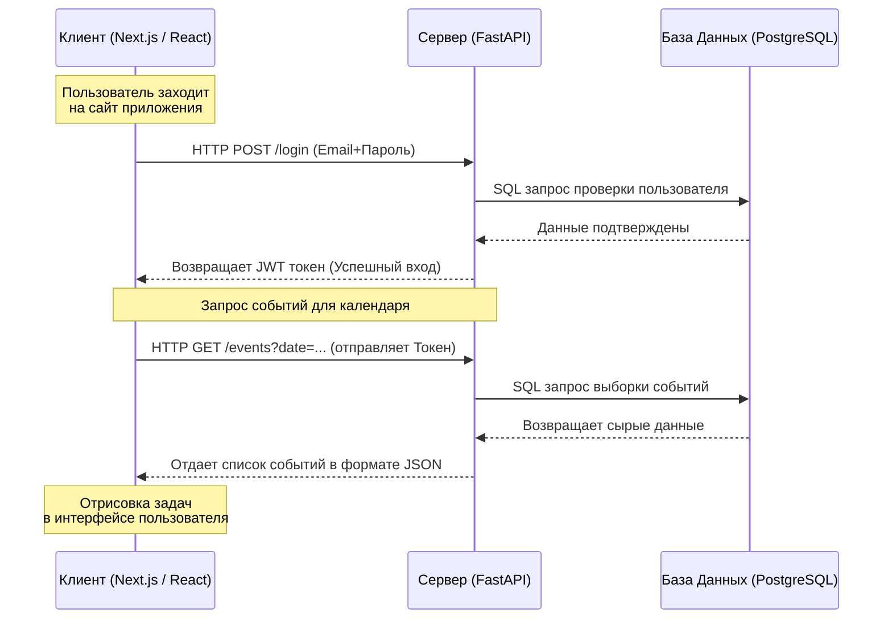

# Отчёт по курсовому проекту: Умный планировщик задач

## 1. Краткий обзор приложения

Представленное веб-приложение — это «Умный планировщик задач» (Smart Planner), созданный для удобного управления личными делами, встречами и заметками. Главная цель приложения: объединить календарь, список задач и заметки в одном простом интерфейсе.

Приложение построено на современных технологиях:
- **Серверная часть (Backend)**: Написана на языке Python с использованием фреймворка FastAPI. База данных — PostgreSQL. Для безопасности пользователей внедрена система регистраций и авторизаций по паролю (JWT-токены).
- **Клиентская часть (Frontend)**: Построена на библиотеке React (используется Next.js). Дизайн приложения полностью адаптивный и стилизован с помощью Tailwind CSS. 

Работая с приложением, пользователь может:
1. Зарегистрироваться и создать свой личный профиль.
2. Добавлять, редактировать или удалять события, встречи и задачи в интерактивном календаре.
3. Оставлять текстовые заметки с привязкой к конкретному дню.
4. Отслеживать свою статистику (аналитику) и получать удобную сводку своих активностей за выбранный период.

---

## 2. Основные экраны и интерфейс работы

> *(Примечание: вставьте скриншоты ниже по ходу текста в вашей курсовой)*

### 2.1. Авторизация и регистрация
При первом запуске пользователь видит форму для входа. Доступен как вход в существующий аккаунт, так и создание нового профиля. Защита данных обеспечивается хэшированием паролей.

***[ ВСТАВИТЬ СКРИНШОТ: Окно входа в систему (Login) ]***

***[ ВСТАВИТЬ СКРИНШОТ: Окно регистрации пользователя (Register) ]***

### 2.2. Главный экран (Dashboard)
После входа открывается главный экран планировщика. Здесь расположен календарь, а также список запланированных дел (задач и встреч) на выбранный пользователем день. 

***[ ВСТАВИТЬ СКРИНШОТ: Главный экран с открытым днем и списком задач ]***

### 2.3. Создание и редактирование событий
Для создания новой задачи необходимо нажать кнопку добавления. Откроется специальная форма, где можно указать название, описание, время начала и конца, а также тип (встреча, личное дело и прочее).

***[ ВСТАВИТЬ СКРИНШОТ: Всплывающее окно / форма создания события ]***

### 2.4. Сводная статистика (Аналитика)
Система собирает данные и предоставляет пользователю отчет о его продуктивности: сколько всего выполнено дел, как они распределяются по типам и дням активности.

***[ ВСТАВИТЬ СКРИНШОТ: Графики аналитики и список завершенных дел ]***

---

## 3. Схема взаимодействия Клиент-Сервер

Архитектура приложения построена по современному принципу разделения на клиентскую и серверную части. Взаимодействие между визуальным интерфейсом и серверной логикой осуществляется по протоколу HTTP в формате REST API.



Данная схема демонстрирует базовый жизненный цикл запроса: браузер пользователя (Клиент) запрашивает информацию у нашего изолированного сервиса (Сервер), который, в свою очередь, валидирует данные, выполняет выборку из хранилища (База Данных) и возвращает ответ для его отрисовки.

---

## 4. Структура базы данных

База данных работает под управлением СУБД PostgreSQL и является реляционной. Она состоит из 5 основных таблиц:

1. **`users` (Пользователи)**
   - Хранит учетные данные системы (email, имя, зашифрованный пароль).
   - Является родительской таблицей для всех остальных (связь «Один-ко-многим»).
2. **`events` (События календаря)**
   - Хранит объекты календаря (название, дата, время, тип события, ссылка).
   - Внешним ключом `user_id` ссылается на таблицу пользователей.
3. **`notes` (Заметки)**
   - Текстовые документы пользователя, которые могут быть привязаны к конкретной дате.
4. **`event_templates` (Шаблоны)**
   - Заготовки для быстрого создания однотипных задач с предустановленным названием и длительностью.
5. **`notifications` (Уведомления)**
   - Запланированные системой оповещения для пользователя, содержащие текст сообщения и статусы отправки (`is_read`).

---

## 5. Листинг программного кода (Backend-сервер)

Ниже представлен базовый архитектурный код серверной части приложения.

### 5.1. Структура базы данных (models.py)
Здесь описаны основные сущности базы данных: Пользователи, События, Шаблоны и Заметки. Используется ORM SQLAlchemy.

```python
from datetime import datetime, date, time
from sqlalchemy import Column, Integer, String, Boolean, DateTime, Date, Time, ForeignKey, Text, func
from sqlalchemy.orm import relationship
from db import Base

class User(Base):
    __tablename__ = "users"
    id = Column(Integer, primary_key=True, index=True)
    email = Column(String(255), unique=True, nullable=False, index=True)
    name = Column(String(255), nullable=False)
    password_hash = Column(String(255), nullable=True)
    created_at = Column(DateTime, server_default=func.now(), nullable=False)
    
    events = relationship("Event", back_populates="user", cascade="all, delete-orphan")

class Event(Base):
    __tablename__ = "events"
    id = Column(Integer, primary_key=True, index=True)
    user_id = Column(Integer, ForeignKey("users.id", ondelete="CASCADE"), nullable=False)
    title = Column(String(512), nullable=False)
    description = Column(Text, nullable=True)
    date = Column(Date, nullable=False, index=True)
    start_time = Column(Time, nullable=True)
    end_time = Column(Time, nullable=True)
    type = Column(String(50), nullable=False, default="task") 
    
    user = relationship("User", back_populates="events")
```

### 5.2. Точка входа в приложение (main.py)
Главный файл сервера. Он подключает все маршруты, настраивает политики защиты (CORS) и инициализирует базу данных.

```python
from fastapi import FastAPI
from fastapi.middleware.cors import CORSMiddleware
from db import engine, Base
import models
from routers import auth, events, notes, templates, analytics, notifications

app = FastAPI(
    title="Smart Planner API",
    description="REST API для курсового проекта",
    version="1.0.0",
)

app.add_middleware(
    CORSMiddleware,
    allow_origins=["http://localhost:3000", "http://127.0.0.1:3000"],
    allow_credentials=True,
    allow_methods=["*"],
    allow_headers=["*"],
)

@app.on_event("startup")
def on_startup():
    Base.metadata.create_all(bind=engine)

app.include_router(auth.router)
app.include_router(events.router)
app.include_router(analytics.router)
```

### 5.3. Обработка событий планировщика (routers/events.py)
Пример реализации CRUD (создание, чтение, обновление, удаление) для событий пользователя.

```python
from datetime import date
from typing import List, Optional
from fastapi import APIRouter, Depends, Query, status
from sqlalchemy.orm import Session
from db import get_session
import models
import schemas
from auth import get_current_user

router = APIRouter(prefix="/api/events", tags=["events"])

@router.get("", response_model=List[schemas.EventOut])
def get_events(
    from_date: Optional[date] = Query(None, description="Начало"),
    to_date: Optional[date] = Query(None, description="Конец"),
    current_user: models.User = Depends(get_current_user),
    db: Session = Depends(get_session),
):
    query = db.query(models.Event).filter(models.Event.user_id == current_user.id)
    if from_date:
        query = query.filter(models.Event.date >= from_date)
    if to_date:
        query = query.filter(models.Event.date <= to_date)
    return query.order_by(models.Event.date).all()

@router.post("", response_model=schemas.EventOut, status_code=status.HTTP_201_CREATED)
def create_event(
    data: schemas.EventCreate,
    current_user: models.User = Depends(get_current_user),
    db: Session = Depends(get_session),
):
    event = models.Event(**data.model_dump(), user_id=current_user.id)
    db.add(event)
    db.commit()
    db.refresh(event)
    return event
```

### 5.4. Обработка статистики (routers/analytics.py)
Пример бизнес-логики: сбор аналитики для пользователя.

```python
from collections import defaultdict
from fastapi import APIRouter, Depends
from sqlalchemy.orm import Session
from sqlalchemy import func
from db import get_session
import models
import schemas
from auth import get_current_user

router = APIRouter(prefix="/api/analytics", tags=["analytics"])

@router.get("", response_model=schemas.AnalyticsOut)
def get_analytics(
    current_user: models.User = Depends(get_current_user),
    db: Session = Depends(get_session),
):
    events = db.query(models.Event).filter(models.Event.user_id == current_user.id).all()
    
    type_counts = defaultdict(int)
    for event in events:
        type_counts[event.type] += 1
        
    by_type = [
        schemas.EventTypeCount(type=t, count=c)
        for t, c in sorted(type_counts.items())
    ]
    
    total_notes = db.query(func.count(models.Note.id)).filter(models.Note.user_id == current_user.id).scalar()

    return schemas.AnalyticsOut(
        total_events=len(events),
        by_type=by_type,
        daily_activity=[], 
        total_notes=total_notes or 0,
    )
```

### 5.5. Блок настройки контейнеров (docker-compose.yml)
Листинг настроек инфраструктуры проекта.

```yaml
version: "3.9"

services:
  postgres:
    image: postgres:16-alpine
    container_name: planner_postgres
    restart: unless-stopped
    environment:
      POSTGRES_USER: planner
      POSTGRES_PASSWORD: planner
      POSTGRES_DB: planner_db
    ports:
      - "5432:5432"

  backend:
    build:
      context: ./backend
      dockerfile: Dockerfile
    container_name: planner_backend
    restart: unless-stopped
    env_file:
      - ./backend/.env
    ports:
      - "8000:8000"
    depends_on:
      - postgres
```
*(Конец листинга)*
